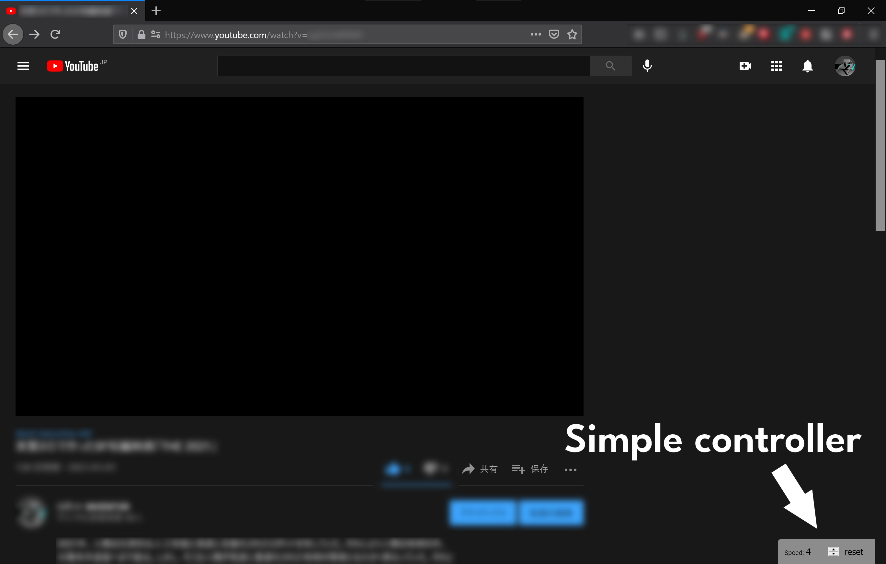
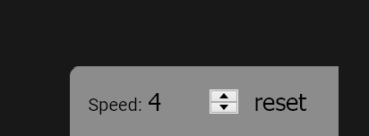
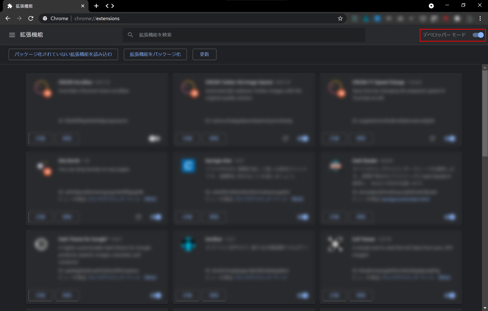
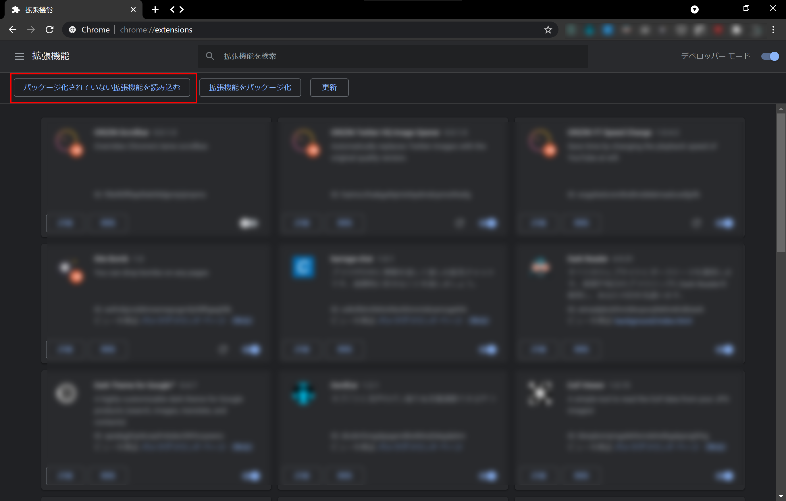

# YT Speed Change

[日本語](README_ja.md)

Save time by changing the playback speed of YouTube at well.

## What Is This?

This is a browser extension which adds a video playback speed controller to the bottom right corner of the YouTube.

You can directly enter the playback speed value in the controller, or you can use the mouse wheel to control it intuitively. You can reset the playback speed with the touch of a button. You can set to 0.1x or 4x, which is not possible with the standard YouTube playback speed setting.

## How to Install?

### Google Chrome

#### 1. Download

First, download the source code from this repository any way you like (using git or downloading in zip format).

#### 2. Install

Type ``chrome://extensions/`` in the address bar, and enable developer mode.

Click [Load Unpacked] and select the folder you downloaded the extension to.

### Firefox

Just install from [AMO](https://addons.mozilla.org/ja/firefox/addon/yt-speed-change/).

## Bugs And Features to Be Implemented

This extension is currently under development. It has the following known bugs.

- Bug: Playback speed controller is also displayed in YouTube Studio

In addition, the following features will be implemented.

- Automatically hide the playback speed controller when in full screen mode
