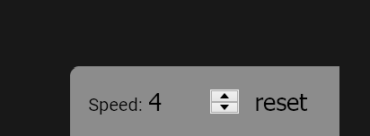
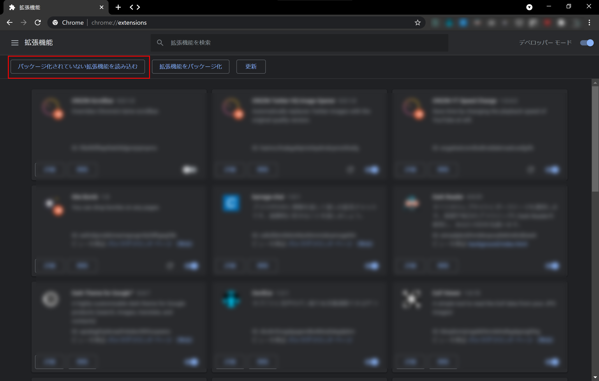

# YT Speed Change

[English](README.md)

YouTubeの再生速度を自在に変更して時間を節約。

## 何ができるの？

このブラウザー拡張機能は、YouTubeの右下に動画再生速度のコントローラーを追加します。

再生速度の値をコントローラーに直接入力できますし、マウスホイールを使った直感的な操作もできます。また、ワンタッチで再生速度をリセットできます。YouTube標準の再生速度設定ではできない、0.1倍速や4倍速にも設定できます。

## インストール方法

### Google Chrome

#### 1. ダウンロード

まず、このリポジトリから何らかの方法でソースコードをダウンロードします（gitを使うか、zip形式でダウンロードします）。

#### 2. インストール

アドレスバーに``chrome://extensions/``と入力し、 [デベロッパーモード] を有効にします。

[パッケージ化されていない拡張機能を読み込む] をクリックし、拡張機能をダウンロードしたフォルダーを選択します。

### Firefox

[AMO](https://addons.mozilla.org/ja/firefox/addon/yt-speed-change/)からインストールするだけです。

## バグと実装予定の機能

この拡張機能は現在開発途中です。次の機能を実装予定です。

- 全画面表示にしたとき、再生速度コントローラーを自動で非表示にする機能
